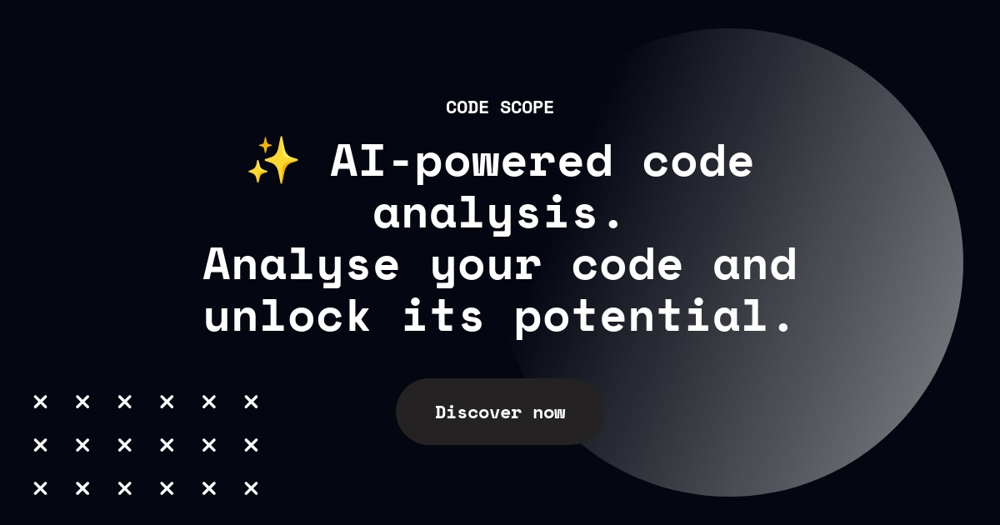

<!-- ALL-CONTRIBUTORS-BADGE:START - Do not remove or modify this section -->

<!-- ALL-CONTRIBUTORS-BADGE:END -->

<h1 align="center">
  Code Scope
</h1>

<h3 align="center">
  ✨ AI-powered code analysis. Analyse your code and unlock its potential.
</h3>

## About project

Play around with AI

## What’s In This Document

- [How to Contribute](#-how-to-contribute)
- [License](#memo-license)
- [Thanks to Our Contributors](#-thanks)

## ❗ Code of Conduct

We expect everyone to abide by our [**Code of Conduct**](./CODE_OF_CONDUCT.md). Please read it. 🤝

## 🙌🏻 How to Contribute

Check out our [**Contributing Guide**](./CONTRIBUTING.md) for information on contributing.

## :memo: License

Licensed under the [MIT License](./LICENSE).

## 💜 Thanks

Thanks to everyone contributing in any manner for this repo and we extend this thanks to everyone working on Open Source.

**Sharing is Caring**

## Contributors ✨

Thank's goes to these wonderful people ([emoji key](https://allcontributors.org/docs/en/emoji-key)):
## Contributors

<!-- ALL-CONTRIBUTORS-LIST:START - Do not remove or modify this section -->
<!-- prettier-ignore-start -->
<!-- markdownlint-disable -->

<!-- markdownlint-restore -->
<!-- prettier-ignore-end -->

<!-- ALL-CONTRIBUTORS-LIST:END -->

This project follows the [all-contributors](https://github.com/all-contributors/all-contributors) specification. Contributions of any kind welcome!
